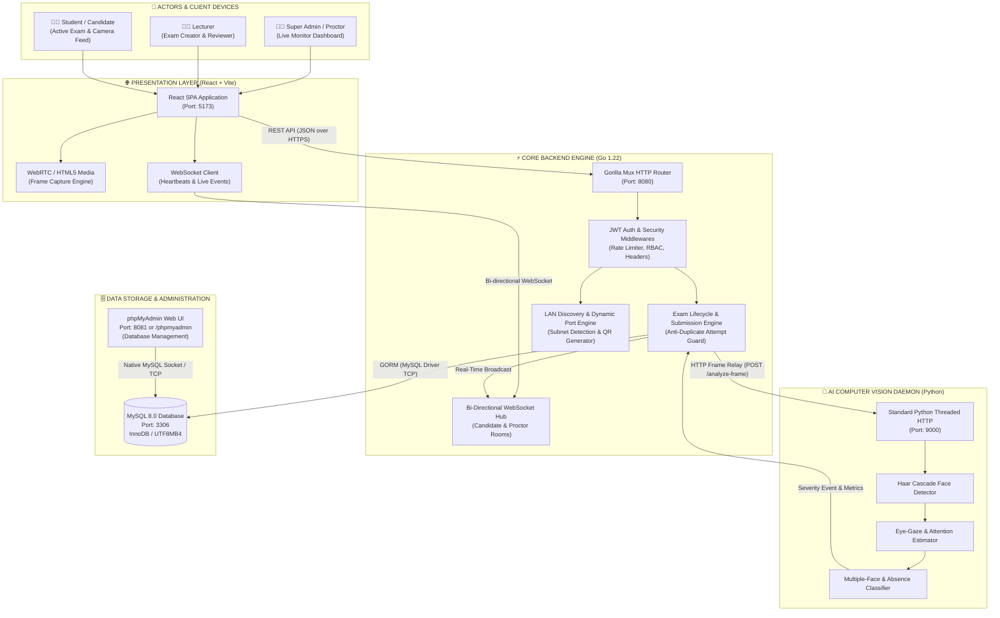
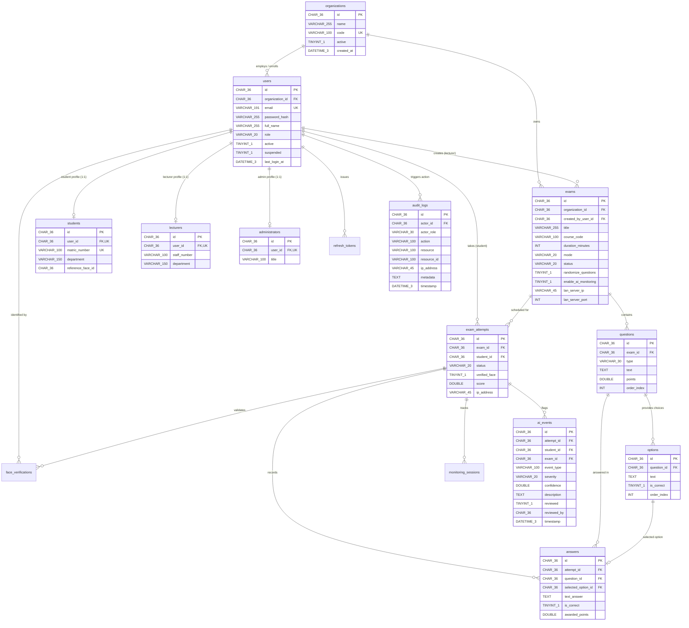
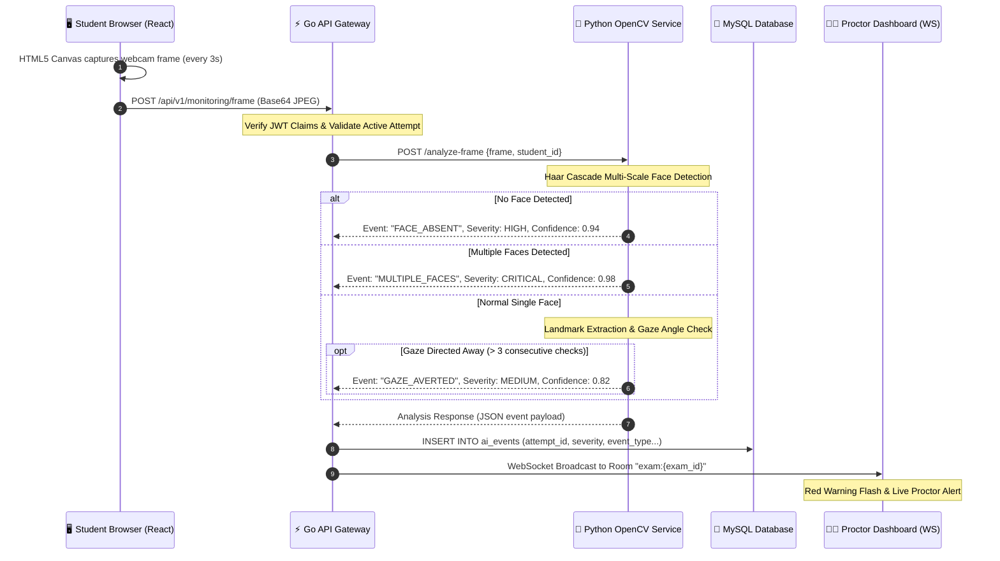
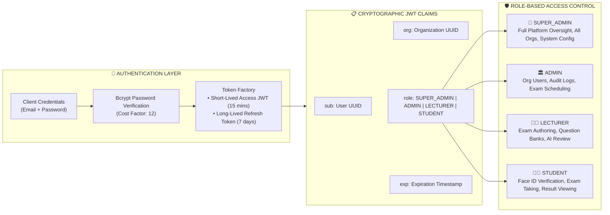
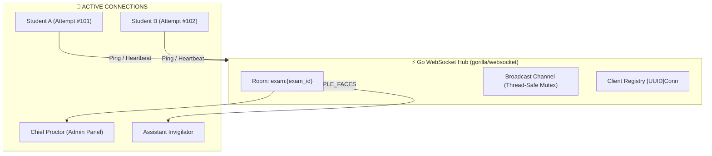

<div align="center">

# 🛡️ EXAM SHIELD
### Next-Generation AI-Powered Examination Integrity, Proctoring & Invigilation Platform


<br/>

```
  ███████╗██╗  ██╗ █████╗ ███╗   ███╗    ███████╗██╗  ██╗██╗███████╗██╗     ██████╗ 
  ██╔════╝╚██╗██╔╝██╔══██╗████╗ ████║    ██╔════╝██║  ██║██║██╔════╝██║     ██╔══██╗
  █████╗   ╚███╔╝ ███████║██╔████╔██║    ███████╗███████║██║█████╗  ██║     ██║  ██║
  ██╔══╝   ██╔██╗ ██╔══██║██║╚██╔╝██║    ╚════██║██╔══██║██║██╔══╝  ██║     ██║  ██║
  ███████╗██╔╝ ██╗██║  ██║██║ ╚═╝ ██║    ███████║██║  ██║██║███████╗███████╗██████╔╝
  ╚══════╝╚═╝  ╚═╝╚═╝  ╚═╝╚═╝     ╚═╝    ╚══════╝╚═╝  ╚═╝╚═╝╚══════╝╚══════╝╚═════╝ 
```

<br/>

**Architected & Engineered by:**  
### 🌟 **Awodele Kehinde** 🌟  
*Lead Systems Architect & Security Engineer*

<p align="center">
  <b>Uncompromising Academic Integrity</b> • <b>Real-Time Computer Vision</b> • <b>Zero-Trust RBAC</b> • <b>Dual-Mode (Online Cloud & Offline Air-Gapped LAN)</b>
</p>

---

</div>

## 📑 Table of Contents

1. [🌟 Executive Overview](#-executive-overview)
2. [🏛️ System Architecture Diagrams](#️-system-architecture-diagrams)
   - [2.1 End-to-End System Macro-Architecture](#21-end-to-end-system-macro-architecture)
   - [2.2 Microservice Triad & Communication Topology](#22-microservice-triad--communication-topology)
   - [2.3 Relational Database Schema ERD](#23-relational-database-schema-erd)
   - [2.4 Dual-Mode Deployment Architecture (Cloud vs. Offline LAN)](#24-dual-mode-deployment-architecture-cloud-vs-offline-lan)
   - [2.5 AI Computer Vision & Proctoring Integrity Pipeline](#25-ai-computer-vision--proctoring-integrity-pipeline)
   - [2.6 Zero-Trust Security & RBAC Matrix](#26-zero-trust-security--rbac-matrix)
   - [2.7 Real-Time WebSocket Monitoring Hub](#27-real-time-websocket-monitoring-hub)
3. [🐬 Running the Database with phpMyAdmin (Complete Guide)](#-running-the-database-with-phpmyadmin-complete-guide)
   - [3.1 Method 1: Local Setup with XAMPP / WAMP / Laragon](#31-method-1-local-setup-with-xampp--wamp--laragon-recommended-for-windows)
   - [3.2 Method 2: Containerized Setup with Docker & phpMyAdmin](#32-method-2-containerized-setup-with-docker--phpmyadmin)
   - [3.3 Turnkey SQL Database Import](#33-turnkey-sql-database-import)
   - [3.4 Database Connection Configuration (DSN)](#34-database-connection-configuration-dsn)
   - [3.5 Managing Tables & Verifying Data in phpMyAdmin](#35-managing-tables--verifying-data-in-phpmyadmin)
4. [🚀 Quickstart & Local Deployment](#-quickstart--local-deployment)
5. [🔐 Default Credentials & Seed Accounts](#-default-credentials--seed-accounts)
6. [📦 Project Directory Structure](#-project-directory-structure)
7. [🛡️ Privacy-by-Design & Legal Compliance](#️-privacy-by-design--legal-compliance)
8. [👨‍💻 Author & Attribution](#-author--attribution)

---

## 🌟 Executive Overview

**Exam Shield** is a high-security, carrier-grade digital examination and automated invigilation platform designed to eliminate academic dishonesty in both remote online assessments and campus-wide institutional environments. 

### Core Technology Stack:
- **Core Business API & Security Engine:** **Go (Golang)** using GORM, Gorilla Mux, Gorilla WebSockets, and crypto primitives.
- **Relational Storage:** **MySQL 8.0 / MariaDB** (with **phpMyAdmin** visual administration) using `CHAR(36)` binary-lossless UUID keys and strict foreign key integrity.
- **AI Computer Vision Service:** **Python** using standard library `http.server` and **OpenCV** (Haar Cascade multi-scale face detection, landmark geometry, eye-gaze tracking, and anomaly scoring).
- **Interactive Single-Page Application (SPA):** **React 18** powered by **Vite**, featuring a modern White + Indigo/Purple design system with role-segregated portals.

> [!IMPORTANT]
> **Strict Microservice Boundary:** React **never** communicates directly with the Python AI service or the MySQL database. All traffic passes through the Go gateway where JWT verification, role-based authorization, rate limiting, and request sanitization are strictly enforced.

---

## 🏛️ System Architecture Diagrams

### 2.1 End-to-End System Macro-Architecture

The following diagram illustrates how actors interact with the frontend, how requests terminate on the Go core API, how frames are processed by the Python vision daemon, and how data persists in MySQL and phpMyAdmin:



---

### 2.2 Microservice Triad & Communication Topology

```
┌─────────────────────────────────────────────────────────────────────────────┐
│                            EXAM SHIELD TRIAD                                │
└─────────────────────────────────────────────────────────────────────────────┘

 [ React Frontend ] ──(1) REST / JSON ───────► [ Go Backend Core ]
 [ (Vite, Port 5173)] ◄──(2) WebSockets (ws://)─► [ (Port 8080)     ]
                                                        │         ▲
                                            (3) HTTP    │         │ (4) Verdict
                                                Relay   ▼         │     Metadata
                                               [ Python AI Service ]
                                               [ (OpenCV, Port 9000)]
                                                        │
                                                        │ (5) GORM TCP 3306
                                                        ▼
                                               [ MySQL Database   ] ◄── [ phpMyAdmin ]
                                               [ (Port 3306)      ]     [ (Port 8081) ]
```

| Communication Path | Protocol | Serialization | Purpose |
| :--- | :--- | :--- | :--- |
| **Frontend ➔ Go** | HTTP/1.1 or HTTP/2 | JSON | Authentication, Exam submission, CRUD, Answers |
| **Frontend ⇄ Go** | WebSocket (`ws://`, `wss://`) | JSON Packets | Bi-directional monitoring, alerts, ping/pong heartbeats |
| **Go ➔ Python AI** | Internal HTTP POST | Multipart / Base64 | Camera frame relay for instantaneous CV facial analysis |
| **Go ➔ MySQL** | MySQL Native Wire Protocol | TCP Packets | ACID transactions, attempt records, questions, audit logs |
| **phpMyAdmin ➔ MySQL** | TCP Socket 3306 | SQL Queries | Visual schema migration, data browsing, candidate review |

---

### 2.3 Relational Database Schema ERD

All primary and foreign identifier keys in Exam Shield are represented as standard **`CHAR(36)` UUID strings** for cross-platform compatibility, universal readability in phpMyAdmin, and high-performance indexing under the InnoDB storage engine.



---

### 2.4 Dual-Mode Deployment Architecture (Cloud vs. Offline LAN)

Exam Shield is uniquely engineered to operate in two mutually distinct environments:

```mermaid
graph TD
    subgraph ModeA[" ☁️ ONLINE CLOUD MODE "]
        PublicInternet["🌐 Public Internet / CDN"]
        CloudLB["Cloud Load Balancer / Ingress"]
        CentralBackend["Centralized Go Backend Cluster"]
        CloudMySQL[(Managed MySQL Instance)]
        StudentRemote["🧑‍🎓 Remote Student (Home / Broadband)"]
        ProctorRemote["👨‍💼 Remote Invigilator"]

        StudentRemote --> PublicInternet
        ProctorRemote --> PublicInternet
        PublicInternet --> CloudLB --> CentralBackend --> CloudMySQL
    end

    subgraph ModeB[" 🏫 AIR-GAPPED OFFLINE LAN MODE (ZERO-INTERNET) "]
        InvigLaptop["💻 Invigilator Machine<br/>(Runs Go Host + MySQL + AI Service)"]
        InterfaceDetect["Dynamic Host NIC Discovery<br/>(192.168.x.x / 10.x.x.x)"]
        PortScanner["Dynamic Port Range Scanner<br/>(Ports 8181 - 8199)"]
        QREngine["Base64 PNG QR Code Generator"]
        
        LocalWiFi["📶 Local Wi-Fi Router / Hotspot (No WAN Needed)"]
        LabStudent1["🧑‍🎓 Lab Student 1 (Laptop)"]
        LabStudent2["🧑‍🎓 Lab Student 2 (Tablet)"]
        LabStudent3["🧑‍🎓 Lab Student 3 (Mobile)"]

        InvigLaptop --> InterfaceDetect --> PortScanner --> QREngine
        QREngine -- "Displays QR on Projector" --> LabStudent1 & LabStudent2 & LabStudent3
        LabStudent1 & LabStudent2 & LabStudent3 -- "Connects via Local Wi-Fi" --> LocalWiFi --> InvigLaptop
    end
```



#### How LAN Mode Works:
1. **Network Interface Discovery:** When an exam is flagged as `LAN` mode, the Go server inspects host physical adapters (avoiding Docker `172.17.x.x` bridges) to locate the host machine's genuine Wi-Fi/Ethernet IPv4 address.
2. **Ephemeral Port Allocation:** The server probes ports between `8181` and `8199` to bind an isolated, dedicated exam socket.
3. **Instant QR Code Generation:** A base64-encoded PNG QR code containing the full LAN connection URI (`http://192.168.1.150:8181/exam/c0a8...`) is generated in memory using Go and presented on the invigilator's projector screen.
4. **Air-Gapped Operation:** Zero Internet connectivity is required; students can submit answers and stream telemetry entirely over local LAN packets.

---

### 2.5 AI Computer Vision & Proctoring Integrity Pipeline



> [!TIP]
> **Human-in-the-Loop Safeguard:** The AI engine **never** auto-fails a candidate. It classifies incidents into five calibrated tiers (`INFO`, `LOW`, `MEDIUM`, `HIGH`, `CRITICAL`). Final disciplinary action remains strictly with the human proctor via the "Reviewed" workflow.

---

### 2.6 Zero-Trust Security & RBAC Matrix



| Role | Manage Orgs | Create Exams | Edit Questions | View Audit Logs | Start Exam Session | Review AI Events |
| :--- | :---: | :---: | :---: | :---: | :---: | :---: |
| **SUPER_ADMIN** | ✅ | ✅ | ✅ | ✅ | ✅ | ✅ |
| **ADMIN** | ❌ | ✅ | ✅ | ✅ | ✅ | ✅ |
| **LECTURER** | ❌ | ✅ | ✅ | ❌ | ❌ | ✅ |
| **STUDENT** | ❌ | ❌ | ❌ | ❌ | ✅ | ❌ |

---

### 2.7 Real-Time WebSocket Monitoring Hub



---

## 🐬 Running the Database with phpMyAdmin (Complete Guide)

Exam Shield supports **MySQL 8.0 / MariaDB** and provides immediate visual management through **phpMyAdmin**.

---

### 3.1 Method 1: Local Setup with XAMPP / WAMP / Laragon (Recommended for Windows)

If you already have **XAMPP**, **WAMP**, or **Laragon** installed on your Windows machine:

#### Step 1: Start Apache & MySQL
1. Open the **XAMPP Control Panel** (or your Laragon / WAMP manager).
2. Click **Start** on the **Apache** service.
3. Click **Start** on the **MySQL** service.
4. Ensure both services show green indicators.

#### Step 2: Open phpMyAdmin
1. Open your browser and navigate to:
   ```
   http://localhost/phpmyadmin
   ```
2. You will be greeted by the phpMyAdmin dashboard.

#### Step 3: Create the `examshield` Database
1. In phpMyAdmin, click on **New** on the left sidebar.
2. Under **Database name**, enter:
   ```text
   examshield
   ```
3. Under **Collation**, select:
   ```text
   utf8mb4_unicode_ci
   ```
4. Click **Create**.

#### Step 4: Import the Pre-Built SQL Schema
1. With the `examshield` database selected, click the **Import** tab on the top menu bar.
2. Click **Choose File** (or Browse).
3. Select the turnkey SQL script included in this repository:
   ```text
   backend/migrations/examshield_mysql.sql
   ```
   *(A duplicate copy is also located directly in the root directory: `examshield_mysql.sql`)*
4. Leave all other settings at their default values and click the **Import** (or **Go**) button at the bottom.
5. You will see a success message: **"Import has been successfully finished, 16 tables created and demo data seeded."**

#### Step 5: Start the Go Backend
Open your terminal in `backend/` and run:

```powershell
# In PowerShell (Windows):
$env:DATABASE_URL="root:@tcp(127.0.0.1:3306)/examshield?charset=utf8mb4&parseTime=True&loc=Local"
$env:AI_SERVICE_URL="http://localhost:9000"
go run ./cmd/server
```

*(Note: If your MySQL root account has a password, use `root:your_password@tcp(127.0.0.1:3306)/...`)*

---

### 3.2 Method 2: Containerized Setup with Docker & phpMyAdmin

If you prefer running everything in Docker with zero host dependencies:

```bash
docker compose up --build -d
```

Docker Compose launches four unified services:
- **MySQL 8.0**: Available on port `3306`
- **phpMyAdmin**: Available on port `8081` ➔ **http://localhost:8081**
- **Go Backend API**: Available on port `8080` ➔ **http://localhost:8080/api/v1**
- **React Frontend**: Available on port `5173` ➔ **http://localhost:5173**
- **Python AI Service**: Available on port `9000` ➔ **http://localhost:9000**

#### Accessing Containerized phpMyAdmin:
1. Open your browser and visit:
   ```
   http://localhost:8081
   ```
2. Enter the container credentials:
   - **Server:** `mysql` (or leave default)
   - **Username:** `root`
   - **Password:** `examshield_root`
3. You will have full access to inspect, browse, and edit all Exam Shield tables.

---

### 3.3 Turnkey SQL Database Import

The included `examshield_mysql.sql` provides:
- Complete table structures with InnoDB foreign key constraints.
- Optimized indices matching GORM naming conventions.
- Pre-seeded Demo Data:
  - 1 Organization: **Apex Institute of Technology** (`APEX-TECH`)
  - 1 Super Admin: `admin@examshield.edu` (Full administrative privileges)
  - 1 Lecturer: `lecturer@examshield.edu` (Course instructor profile)
  - 1 Student: `student@examshield.edu` (Enrolled student profile)
  - 1 Published Exam: **CSC401 - Advanced Distributed Systems**
  - 3 Multi-format exam questions with randomized option choices.

---

### 3.4 Database Connection Configuration (DSN)

The Go backend reads its connection configuration from the `DATABASE_URL` environment variable.

| Deployment Environment | DSN String Format |
| :--- | :--- |
| **XAMPP / Local MySQL (No Password)** | `root:@tcp(127.0.0.1:3306)/examshield?charset=utf8mb4&parseTime=True&loc=Local` |
| **Local MySQL (With Password)** | `root:MyPassword123@tcp(127.0.0.1:3306)/examshield?charset=utf8mb4&parseTime=True&loc=Local` |
| **Docker Compose Network** | `examshield:examshield@tcp(mysql:3306)/examshield?charset=utf8mb4&parseTime=True&loc=Local` |
| **Remote Production MySQL** | `app_user:StrongSecret@tcp(db.institution.edu:3306)/examshield?charset=utf8mb4&parseTime=True&loc=Local` |

---

### 3.5 Managing Tables & Verifying Data in phpMyAdmin

Once connected in phpMyAdmin, you can inspect and verify live operations:

| Table Name | What to Inspect / Actions |
| :--- | :--- |
| **`users`** | View all registered accounts, verify roles (`SUPER_ADMIN`, `LECTURER`, `STUDENT`), toggle `suspended` state, or check `last_login_at`. |
| **`exams`** | Check exam status (`DRAFT`, `PUBLISHED`, `ACTIVE`, `ENDED`), edit time limits, and inspect assigned `lan_server_ip` and `lan_server_port`. |
| **`questions` & `options`** | Directly manage question text, points, answer choices, and which choice is flagged `is_correct = 1`. |
| **`exam_attempts`** | Track live student attempts, verify whether face verification was passed (`verified_face = 1`), and inspect final calculated scores. |
| **`ai_events`** | Review proctoring anomaly alerts (`MULTIPLE_FACES`, `FACE_ABSENT`, `GAZE_AVERTED`), view confidence scores, and mark `reviewed = 1`. |
| **`audit_logs`** | Tamper-evident forensic ledger capturing every user login, exam publication, and status change with timestamps and IP addresses. |

---

## 🚀 Quickstart & Local Deployment

### 1. Prerequisites
- **Go 1.22+**
- **Node.js 18+** & **npm**
- **Python 3.10+** (with OpenCV installed)
- **MySQL 8.0+** or **XAMPP / Laragon**

### 2. Step-by-Step Launch

#### Terminal 1: Python AI Invigilation Service
```bash
cd ai-service
python -m venv venv
# On Windows:
.\venv\Scripts\activate
# On Linux/macOS:
source venv/bin/activate

pip install -r requirements.txt
python -m app.main
# AI Service listens on http://localhost:9000
```

#### Terminal 2: Go Backend API Core
```bash
cd backend
# Set your MySQL DSN (or leave default if using standard XAMPP root without password)
$env:DATABASE_URL="root:@tcp(127.0.0.1:3306)/examshield?charset=utf8mb4&parseTime=True&loc=Local"
$env:AI_SERVICE_URL="http://localhost:9000"

go run ./cmd/server
# Backend listens on http://localhost:8080/api/v1
```

#### Terminal 3: React Frontend Portal
```bash
cd frontend
npm install
npm run dev
# React Vite development server opens on http://localhost:5173
```

---

## 🔐 Default Credentials & Seed Accounts

The pre-configured seed script imports three distinct personas for immediate end-to-end testing:

| Role | Email Address | Password | Privileges |
| :--- | :--- | :--- | :--- |
| **Super Admin** | `admin@examshield.edu` | `Admin@123456` | Complete platform control, user management, audit logs |
| **Lecturer** | `lecturer@examshield.edu` | `Lecturer@123456` | Exam authoring, question management, live proctoring |
| **Student** | `student@examshield.edu` | `Student@123456` | Face verification, question answering, live proctoring stream |

> [!CAUTION]
> In production environments, immediately rotate all default passwords and specify a cryptographically random `JWT_SECRET` via environment variables.

---

## 📦 Project Directory Structure

```
exam-shield/
├── README.md                      # Artistic Architecture & Setup Guide (This Document)
├── docker-compose.yml             # Containerized MySQL 8, phpMyAdmin, Go, AI & React
├── examshield_mysql.sql           # Turnkey MySQL Database Schema & Seed Data
│
├── backend/                       # Go Core Business & Gateway Service
│   ├── Dockerfile                 # Distroless multi-stage Go build
│   ├── go.mod                     # Go module definitions (GORM MySQL, Gorilla, JWT)
│   ├── go.sum                     # Checksums for supply chain integrity
│   ├── cmd/
│   │   └── server/
│   │       └── main.go            # Entrypoint: Config, DB connection, router, graceful shutdown
│   ├── migrations/
│   │   ├── examshield_mysql.sql   # Versioned MySQL schema & seeds
│   │   └── README.md
│   └── internal/
│       ├── auth/                  # JWT TokenManager & bcrypt hashing
│       ├── config/                # Environment-driven configuration loader
│       ├── db/                    # MySQL connection & GORM AutoMigrate
│       ├── exam/                  # LAN NIC IP detection & QR Code generator
│       ├── handlers/              # Thin HTTP controller handlers
│       ├── middleware/            # Security headers, rate limiting, JWT & RBAC
│       ├── models/                # GORM entity models with MySQL CHAR(36) tags
│       ├── repositories/          # Pure database access abstractions
│       ├── services/              # Domain logic (auth, exam lifecycle, reporting)
│       ├── websocket/             # Real-time WebSocket proctoring hub
│       └── router.go              # Complete route definitions & middleware wiring
│
├── ai-service/                    # Python Computer Vision Anomaly Detector
│   ├── Dockerfile
│   ├── requirements.txt           # OpenCV, numpy dependencies
│   └── app/
│       ├── main.py                # Threaded HTTP server (/analyze-frame, /verify-face)
│       ├── behavior_detection/    # Temporal anomaly classifiers (gaze, head-tilt)
│       ├── face_detection/        # OpenCV Haar Cascade multi-scale detector
│       └── face_verification/     # Facial feature vector cosine comparator
│
└── frontend/                      # React SPA Web Application
    ├── package.json
    ├── vite.config.ts
    └── src/
        ├── App.tsx
        ├── main.tsx
        ├── components/ui/         # Buttons, Badges, Modals, Cards, Tables
        ├── context/               # AuthContext & WebSocket live connection state
        ├── pages/
        │   ├── admin/             # System Dashboard, User Mgmt, Audit Logs
        │   ├── lecturer/          # Exam Creator, Question Editor, Live Proctor
        │   └── student/           # Face Check, Exam Interface, Result Viewer
        └── styles/
            └── theme.css          # White + Indigo/Purple modern design system
```

---

## 🛡️ Privacy-by-Design & Legal Compliance

Exam Shield adheres to strict international privacy standards (GDPR, FERPA, NDPR):
1. **Zero Raw Video Storage:** Neither MySQL nor local disk storage retains candidate video frames. Video is analyzed in volatile memory inside the Python AI daemon and discarded within milliseconds.
2. **Abstract Feature Vectors:** Face verification stores only normalized numeric descriptors and numerical confidence scores (`0.00 - 1.00`).
3. **Transparent Audit Logging:** Every disciplinary action, proctor intervention, and biometric match produces an unalterable record in `audit_logs` for dispute resolution.

---

## 👨‍💻 Author & Attribution

Exam Shield was designed, architected, and implemented by:

### **Awodele Kehinde**
*Senior Software Architect & Full-Stack Systems Specialist*

For inquiries, technical consultation, or enterprise deployment:
- **Repository:** Exam Shield Integrity Suite
- **Architecture Standard:** Go Clean Architecture + MySQL Relational Rigor + Micro-AI Vision Engine

---

<div align="center">
  <sub>Built with ❤️ and precision by <b>Awodele Kehinde</b>. All rights reserved.</sub>
</div>
